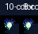
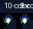
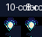

# Okasa — Pixel Sprites Preview

This preview shows the generated pixel-art sprite sheets and animated GIFs for Azumanaga Diaoh (Okasa).

## GIF previews (24px)

- **Jump**

  

- **Kneel**

  

- **Wink**

  

---

## 8-color palette comparison

To compare a tighter 8-color palette for better contrast at small sizes, see the 8-color previews below (generated alongside the main pipeline):

- **Jump (24px, 8-color)**

  

- **Kneel (24px, 8-color)**

  

- **Wink (24px, 8-color)**

  

---

## Side-by-side A/B (10-color vs 8-color)

- **Jump (24px A/B)**

  

- **Kneel (24px A/B)**

  

- **Wink (24px A/B)**

  

---

## Files generated

- Pixel frames: `assets/sprites/pixel/<animation>/` (24/32/48 base sizes, upscaled x3 variants)
- Pixel sheets & atlases: `assets/spritesheets/pixel/` (e.g., `jump_24_sheet.png`, `jump_24_atlas.json`)
- Vector frames: `assets/sprites/` (source SVG frames)

## How to regenerate

1. Ensure dependencies: `pip install -r requirements.txt` (includes `pillow`, `cairosvg`)
2. Convert SVGs to PNG frames (if new or modified):

   ```bash
   python3 scripts/build_sprites.py
   ```

3. Generate pixel sprites & previews:

   ```bash
   python3 scripts/pixelize_sprites.py
   ```

## Notes for reviewers

- The pipeline uses a 10-color Okasa palette tuned for readability at 24px. If you want higher contrast or fewer colors, I can try 8–10 variations and regenerate quickly.
- GIF previews use a 120ms frame duration; tell me if you prefer faster/slower animation.

---

Created on branch `feature/palette-10-and-sprites` — let me know any feedback and I’ll iterate.  
(Assets are committed for easy review; feel free to request a pared-down PR that excludes generated assets if you prefer only scripts.)
